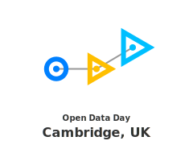

# Open Data Day Cambridge 2018 

## Saturday March 3rd, 2018
The event will run from around 10:00 - 16:30. [See full schedule](schedule.md)

## About
Open Data Day Cambridge is part of the global [Open Data Day](http://opendataday.org/) celebration and exploration of Open Data. 
You're invited to come explore open data sets in a casual and friendly environment. Food will be provided, and there is the option of a travel / childcare bursary to encourage diversity within the team.

## What data?
- [Open Data Day.org](http://opendataday.org/#resources) has some open research data you can use
- [data.gov.uk](https://data.gov.uk/) has government-related public data sets, including some APIs,
- You can also bring your own, so long as it's open! 

## Venue

eLife Sciences Publications, Ltd  
1st Floor, 24 Hills Road  
Cambridge CB2 1JP  
UK  

## Organisers

- Naomi Penfold - GitHub: [@npscience](https://github.com/npscience/), Twitter [@npscience](https://twitter.com/npscience)
- Yo Yehudi - GitHub: [@yochannah](https://github.com/yochannah/), Twitter [@yoyehudi](https://twitter.com/yoyehudi), email: yoyehudi@gmail.com

## Sponsors

[Software Sustainability Institute](https://www.software.ac.uk/)

<link href="https://fonts.googleapis.com/css?family=Noto+Sans" rel="stylesheet">

